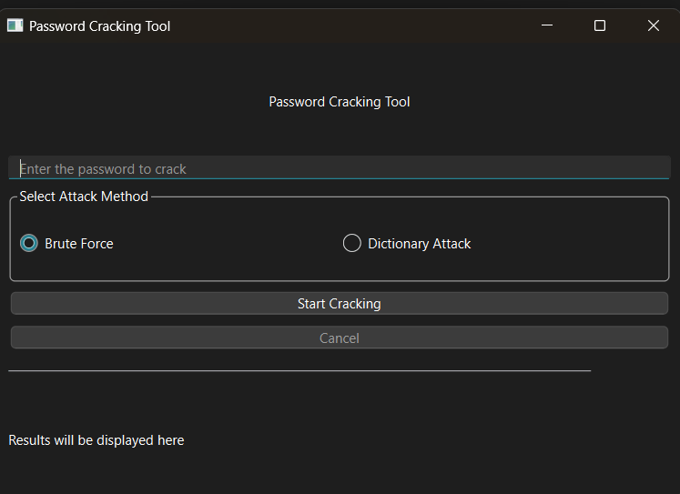

# Password Cracking Tool

## Description

The Password Cracking Tool is an application designed to demonstrate password cracking techniques using a graphical interface. The tool supports both brute force and dictionary attacks for cracking passwords. It features a real-time progress indicator and a cancel button to stop the cracking process if needed. Additionally, it includes a password strength checker to evaluate the complexity of the input password.



## Features

- **Brute Force Attack**: Attempts to crack the password by trying all possible combinations within a specified length.
- **Dictionary Attack**: Uses a list of common passwords from a dictionary file to crack the password.
- **Progress Indicator**: Displays the progress of the cracking process and the current guess.
- **Cancel Button**: Allows users to stop the cracking process at any time.

## Installation

1. Clone the repository:

    ```bash
    git clone https://github.com/Harshdhoot04/Password-Cracking-Tool.git
    ```

2. Navigate to the project directory:

    ```bash
    cd Password-Cracking-Tool
    ```

3. Install the required Python library:

    ```bash
    pip install PySide6
    ```

4. Create a `common_passwords.txt` file in the project directory and add a list of common passwords, each on a new line. This file will be used for the dictionary attack method.

## Usage

1. Run the application:

    ```bash
    python main.py
    ```

2. Enter the password you want to crack in the input field.

3. Select the attack method (Brute Force or Dictionary Attack).

4. Click "Start Cracking" to begin the process.

5. Monitor the progress through the progress bar and result display.

6. Click "Cancel" to stop the cracking process at any time.


## Contributing

Contributions are welcome! Please fork the repository and submit pull requests with your suggestions or improvements. Ensure that you follow the project's coding standards and guidelines.

## License

This project is licensed under the MIT License. See the [LICENSE](LICENSE) file for details.

## Acknowledgements

- **PySide6**: Used for creating the graphical user interface.
- **Python**: The programming language used for developing the tool.
